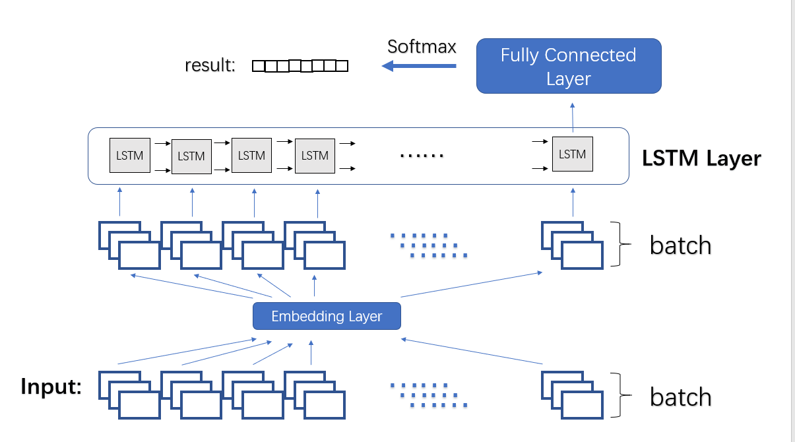

# Sentiment Analysis
A course project in Introduction to Artificial Intelligence

## Introduction
This project utilized CNN and LSTM model to classify news into 8 sentiments. The data is real news extracted from Sina website with sentiments labeled by human readers.

## Architecture
A simple MLP is implemented as the baseline.  

	

Model incorporating CNN:  

	

Model incorporating LSTM:  

	

  
## Result
The best performance of each model is listed below.

  

| Layer   | Baseline | CNN   | LSTM  |
|---------|----------|-------|-------|
| Acc     | 0.469    | 0.530 | 0.512 |
| F-score | 0.130    | 0.280 | 0.209 |
| r       | 0.51     | 0.53  | 0.54  |

  
To be more specific, macro f1-score is adopted to calculate **F-score** and **r** stands for correlation coefficient.